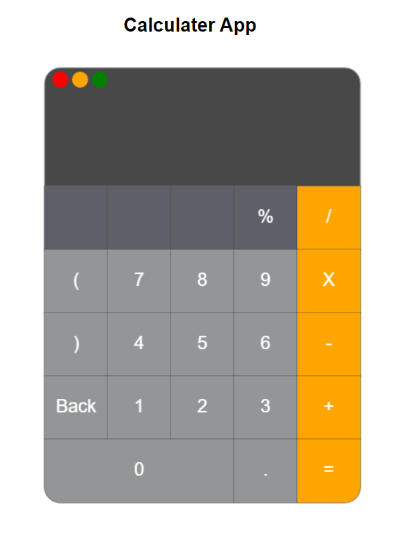

<b>Calculator App</b>  

<b>Use Cases Covered </b>
1. As a user, I should be able to evaluate an expression using the calculator when the "=" button is clicked. 
2. As a user, I should be able to delete a character on the expression using "Back".  
3. As a user, I should be able to see an "Invalid Expression" error message on the value field when the expression is malformed.  
4. As a user, I should be able to use "+ (add), - (subtract), * (multiply), / (divide), % (modulus)" arithmetic operators to construct the expression.  

<b>Functions Used </b>
topScreen(): Draws the outer rectangle of the calculator's top screen.  
navigationCircles(): Creates three colored circles in the top-left corner of the calculator.  
buttonPanel(): Draws the rectangular area containing buttons. 

<b>Buttons </b> br> 
An array named inputButtons defines the buttons, their positions, and colors.  
The createButtons() function is used to draw these buttons on the calculator. 

<b>Calculator Logic </b> 
The calculator supports basic arithmetic operations (+, -, *, /, %) and evaluates expressions.  
The determineValue(determineNumberArray) function takes an array of symbols and calculates the result.  
The createExpression(symbolIdentifiers) function evaluates it.  
The showResult(enteredValue) function processes the user's input and displays the result on the screen.  

<b>On click event </b> 
buttonOnClick(event): Handles user interactions when clicking on buttons. It allows users to input numbers and operators and perform calculations.  

<b>Instructions to use this app </b>  
Open the HTML file in a web browser.  
Click on the buttons to input numbers and operators.  
Click the "=" button to evaluate the expression and see the result.  
Click the "Back" button to delete the last character.  
The top screen displays the entered expression and the result.  

<b>Insructions to run the App: </b>  
1. git clone reporsitory with this link : git@github.com:info-6150-fall-2023/assignment-7-Sanskrutii03.git  
2. Open with VS code, navigate to the assignment-7 folder  
3. Open calculator.html file in live server  

<b>Prepared by</b> :  
Sanskruti Manoria  
nuid - 002623300  

